# Using computer vision to detect tremor acitivity
A project on tremor activity detection based of video analysis using the [MediaPipe Hands Pipeline](https://google.github.io/mediapipe/solutions/hands.html).

## Project description
This project is aimed to validate extracted tremor features from videobased markerless recordings. In a first step, best performance setups were validated using simulated videos. In a second step, the setup best performing recording setup was used to record tremor patients with video, motion capture systems and intertial measurement units. Amplitudes  and spectral features were used for comparison between systems.<br>

## Project structure
```
├── sourcedata (raw markerdata from the CV model)
├── figuredata (source tables for figures and statistics)
├── scripts (Python scripts for data analysis and plotting)
├── src (utilities related to the project)
├── .gitignore (Excludes data and venv in Git)
├── environment.yml (For venv via conda)
└── README.md
```

## Pipeline tremor features

```mermaid
graph LR
    Tremor-Patient--> Camera & IMU & OMC
    
    Camera--> Mediapipe
    IMU--> Python
    OMC--> Qualysis

    Mediapipe--> Position["Position &#91;mm&#93;"] 
    Python--> Acceleration["Acceleration &#91;ms^-2&#93;"]
    Qualysis--> Position  

    Position--> Spectogram
    Acceleration--> Spectogram 
```


## Author
Developed by Robin Wolke and Julius Welzel, Department of Neruology, University of Kiel, (robin.wolke@uksh.de, j.welzel@neurologie.uni-kiel.de) <br>
Supervised by Jos Becktepe, University of Kiel<br>


## Versioning
*Version 0.1 (11.12.2023)*
